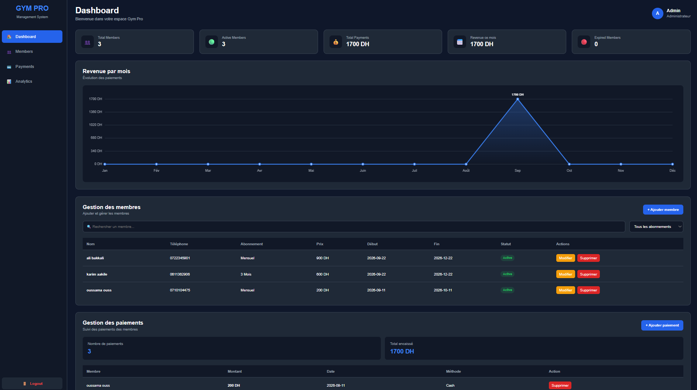

# 🏋️ Gym Pro - Gym Management Dashboard

A modern and responsive Gym Management Dashboard built with HTML, CSS and JavaScript.

## 🌐 Live Demo

## 🌐 Live Demo

👉 **[Open Gym Pro Dashboard](https://contactdetroitcode-oss.github.io/gym-management/)**

## 📸 Screenshot

## ✨ Features

- 🔐 Admin Login
- 📊 Dashboard Statistics
- 👥 Members Management
- ➕ Add Members
- ✏️ Edit Members
- 🗑️ Delete Members
- 🔎 Search Members
- 🔽 Filter Members
- 💳 Payments Management
- 💰 Revenue Tracking
- 📈 Monthly Revenue Chart
- 💾 localStorage
- 📱 Responsive Design
- 🚪 Logout System

## 🛠️ Technologies

- HTML5
- CSS3
- JavaScript
- LocalStorage
- HTML Canvas
- Git
- GitHub Pages

## 🔐 Demo Login

Email:

admin@gympro.com

Password:

1234

## 📂 Project Structure

gym-management/

├── index.html  
├── style.css  
├── js.js  
├── dashboard.html  
├── dashboard.css  
├── dashboard.js  
└── README.md

## 🎯 Project Goal

This project was created as a portfolio project to practice front-end web development and build a realistic gym management system using Vanilla JavaScript.

## 👨‍💻 Author

Oussama

Front-End Web Developer

GitHub:  
https://github.com/contactdetroitcode-oss